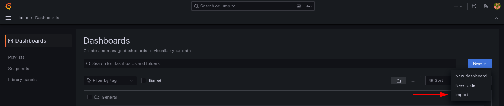

<p align="center">
<a href="https://kafka.apache.org/" target="_blank"></a>
<a href="https://prometheus.io/" target="_blank"></a>
<a href="https://grafana.com/grafana/" target="_blank"></a>
<a href="https://www.conduktor.io/" target="_blank"></a>
<a href="https://www.postgresql.org/" target="_blank"></a>
</p>

# Apache kafka Métricas #

Entorno básico de configuración Métricas para  <a href="https://kafka.apache.org/" target="blank">Apache kafka</a>.

## Descripción

<p align="center">Configuración Cluster de <a href="https://kafka.apache.org/" target="blank">Apache kafka</a> con visualización de métricas utilizando jmx exporter Agent, conexión <a href="https://prometheus.io/" target="blank">Prometheus</a>, <a href="https://grafana.com/grafana/" target="blank">Grafana</a> y <a href="https://www.conduktor.io/" target="blank">Conduktor</a> en contenedores <a href="https://docs.docker.com/compose/" target="blank">Docker</a>.</p>

## Requerimientos

Asegúrese de tener las últimas versiones de **Docker** y **Docker Compose** instaladas en su máquina.

Clona este repositorio o copia los archivos de este repositorio en una nueva carpeta. En el archivo docker-compose.yml puede cambiar los puertos (en caso de que ejecute varios contenedores en su sistema).

Con este proyecto puedes ejecutar rápidamente lo siguiente::

- [Apache Kafka](https://hub.docker.com/r/confluentinc/cp-kafka)
- [Prometheus](https://hub.docker.com/r/prom/prometheus)
- [Grafana](https://hub.docker.com/r/grafana/grafana)
- [Conduktor](https://hub.docker.com/r/conduktor/conduktor-platform)
- [Postgresql](https://hub.docker.com/_/postgres)

Contenido:

- [Apache kafka Métricas](#apache-kafka-métricas)
  - [Descripción](#descripción)
  - [Requerimientos](#requerimientos)
  - [Configuración](#configuración)
  - [Instalación](#instalación)
  - [Uso](#uso)
    - [Prometheus](#prometheus)
    - [Grafana](#grafana)
    - [Conduktor](#conduktor)
  - [Licencia](#licencia)


## Configuración

Edite el `.env` archivo para cambiar las variables de entorno predeterminadas.

## Instalación

Abra una terminal y ejecute `cd` hacia la carpeta en la que podrá ver los archivos  `docker-compose-single-config.yml` que contiene la configuración necesaria para desplegar un broker de kafka y el archivo `docker-compose-multiple-config.yml` que contiene la configuración para multiples broker de apache kafka.

según su necesidad ejecute:

```
docker-compose -f docker-compose-single-config.yml up -d  
```

Esto pondrá en funcionamiento los contenedores y creara los volúmenes según configuración de sus `docker-compose.yml` archivos, asegurese de darle los permisos de escritura al directorio para que pueda crear los `volumenes` necesarios de los container.

* `.env` – archivo que contiene los datos de las variables de entorno.
* `volumenes` – Carpeta que contiene los datos de los contenedores.
* `config` – Carpeta que contiene los archivos de configuración necesarios para el funcionamiento de los contenedores.

Los contenedores ya están construidos y en funcionamiento. Debería poder acceder a la instalación de cada contenedor.

## Uso

### Prometheus

Puede visitar `http:/localhost:9090` para acceder a **Prometheus** después de iniciar los contenedores y podrá ver una Pantalla como la siguiente donde tendra la opcion agregar paneles según sus `query` personalizadas.

<a href="https://github.com/ali-ramirez/kafka-metrics" rel="noreferrer">
<p style="text-align: center;"></p>
</a>

En el menu de Status -> `targets` podrá ver el estado de sus **broker** de **Apache kafka**.

<a href="https://github.com/ali-ramirez/kafka-metrics" rel="noreferrer">
<p style="text-align: center;"></p>
</a>

### Grafana

Puede Visitar `http:/localhost:3000` para acceder a **Grafana**
El nombre de usuario predeterminado es **admin**, datos que se proporciona en el `.env` archivo, el password es **admin** una vez iniciado le pedirá crear una nueva password.

<a href="https://github.com/ali-ramirez/kafka-metrics" rel="noreferrer">
<p style="text-align: center;"></p>
</a>

Una vez iniciada la sesión vera una pantalla como la siguiente:

<a href="https://github.com/ali-ramirez/kafka-metrics" rel="noreferrer">
<p style="text-align: center;"></p>
</a>

Donde deberá agregar su fuente de datos de **Prometheus** como se indica en la imagen.

<a href="https://github.com/ali-ramirez/kafka-metrics" rel="noreferrer">
<p style="text-align: center;"></p>
</a>

Seleccionara **Prometheus** como su fuente de datos.

<a href="https://github.com/ali-ramirez/kafka-metrics" rel="noreferrer">
<p style="text-align: center;"></p>
</a>

Tendra que llenar los datos de su conexión del contenedor de **Prometheus**.

Para Agregar un nuevo Dashboard a **Grafana** selecione `New` seguido de `Import` donde elegirá el Archivo `dashboard-kafka.json`que se encuentra en la carpeta `config` el cual esta configurado para la visualización de las métricas de **Kafka**.

<a href="https://github.com/ali-ramirez/kafka-metrics" rel="noreferrer">
<p style="text-align: center;"></p>
</a>

Una vez importado el archivo obtendrá la siguientes pantallas con multiples paneles y gráficos representando las métricas del `cluster` y `brokers` de **Apache Kafka**.

<a href="https://github.com/ali-ramirez/kafka-metrics" rel="noreferrer">
<p style="text-align: center;"></p>
</a>
<a href="https://github.com/ali-ramirez/kafka-metrics" rel="noreferrer">
<p style="text-align: center;"></p>
</a>
<a href="https://github.com/ali-ramirez/kafka-metrics" rel="noreferrer">
<p style="text-align: center;"></p>
</a>

### Conduktor 

Puede Visitar `http:/localhost:8080` para acceder a **Conduktor**
El nombre de usuario predeterminado es **admin@admin.io**, el password es **admin** las credenciales puede modificarlas en las variables de entorno que se encuentran en el `.env` archivo.

<a href="https://github.com/ali-ramirez/kafka-metrics" rel="noreferrer">
<p style="text-align: center;"></p>
</a>

La herramienta **Conduktor** le permitirá ver el estatus del `cluster` como también visualizar los `brokers` que tenga desplegados de **Apache Kafka**.

<a href="https://github.com/ali-ramirez/kafka-metrics" rel="noreferrer">
<p style="text-align: center;"></p>
</a>

<a href="https://github.com/ali-ramirez/kafka-metrics" rel="noreferrer">
<p style="text-align: center;"></p>
</a>

**Conduktor** le sera util para realizar las pruebas necesarias y administración de  **Apache Kafka** de forma visual,  podrá crear nuevos topic,  como también enviar y consumir mensajes.

<a href="https://github.com/ali-ramirez/kafka-metrics" rel="noreferrer">
<p style="text-align: center;"></p>
</a>

## Licencia

[](http://creativecommons.org/publicdomain/zero/1.0)
